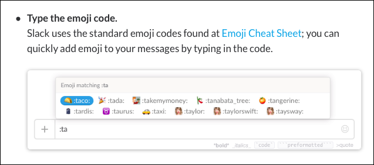

# slack-emoji-shortcuts-plist
Let's craft an OS X text substitutions `plist` file for Slack-style emoji codes

[Slack](https://slack.com) includes a shorthand input method for typing emoji in their desktop applications.



This method of typing emoji is incredibly convenient -- much more so than either invoking the search pane in OS X, or switching keyboards in iOS. Thus, in applications other than Slack, typing emoji is now much more cumbersome than the simple shorthand we've become used to in Slack.

In OS X, [Apple provides a way](https://support.apple.com/en-us/HT204006) to import a `plist` file into System Preferences that contains a dictionary of text substitutions. This will become the vector of import for our custom-crafted `plist` file containing the code/emoji substitution pairs. Once the substitutions are imported into OS X, iCloud syncing can be used to sync the substitutions to iOS.

The structure of the `plist` file is as such:

```xml
<?xml version="1.0" encoding="UTF-8"?>
<!DOCTYPE plist PUBLIC "-//Apple//DTD PLIST 1.0//EN" "http://www.apple.com/DTDs/PropertyList-1.0.dtd">
<plist version="1.0">
<array>
	<dict>
		<key>phrase</key>
		<string>💥</string>
		<key>shortcut</key>
		<string>kapow</string>
	</dict>
</array>
</plist>
```

---

Found another project that basically solves this issue, going to pause development on this while I test it out. 

https://github.com/noahmanger/emoji-text-replacement
